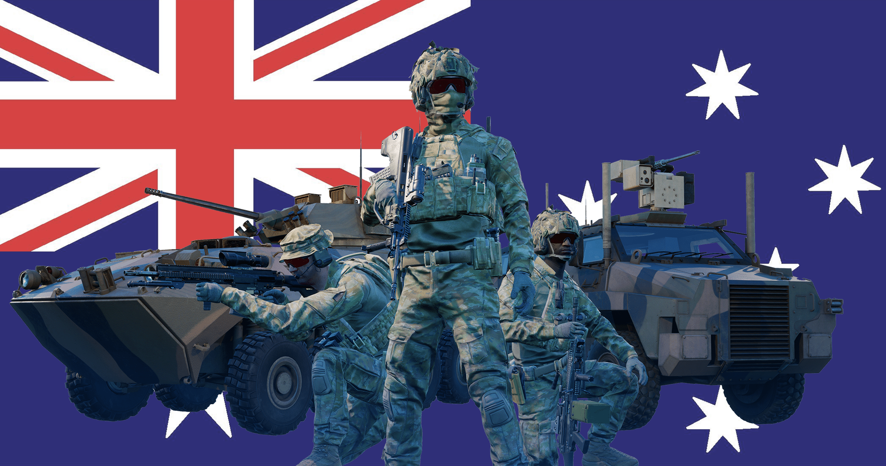

# Australian Defence Force

## Overview
The Australian Defence Force is the military organisation comprising Australia’s army, navy, and air force. Its history lies with the Federation of Australia in 1901. Today it is a modern fighting force which works in close cooperation with Southeast Asian nations, NATO, and the United States.

## Kits & Equipment
| Role Type           | Role                  | Primary Weapon                                              | Secondary Weapon                      | Explosives                                                        | Smoke Grenades                                            | Medical Supplies                | Addtl. Equipment                                             |
|---------------------|-----------------------|-------------------------------------------------------------|---------------------------------------|------------------------------------------------------------------|-----------------------------------------------------------|---------------------------------|-------------------------------------------------------------|
| Command and Support | Section Leader         | EF88 Tracer + Grippod, 7 mags                                | Self-Loading Pistol Mk3, 2 mags       | SOCP Knife, F1 Fragmentation, 2 grenades                        | M18 Smoke White, 2 grenades; M18 Smoke Red, 1 grenade; M18 Smoke Blue, 1 grenade | Field Dressing, 2 packages      | Field Binoculars                                              |
|                     | Rally Point           | EF88 Tracer + ET552 + Grippod, 7 mags; EF88 Tracer + Specter + Grippod, 6 mags | —                                     | F1 Fragmentation, 1 grenade                                      | —                                                         | —                               | —                                                           |
|                     | Lead Crewman          | EF88C Tracer + Specter, 2 mags                               | Self-Loading Pistol Mk3, 2 mags       | SOCP Knife                                                      | M18 Smoke White, 2 grenades                                 | Field Dressing, 2 packages      | Field Binoculars, Vehicle Repair Tools, Rally Point          |
|                     | Lead Pilot            | EF88C Tracer + Specter, 2 mags                               | Self-Loading Pistol Mk3, 2 mags       | SOCP Knife                                                      | M18 Smoke Red, 2 grenades                                   | Field Dressing, 2 packages      | Field Binoculars, Vehicle Repair Tools, Rally Point          |
|                     | Medic                 | EF88 + ET552, 6 mags; EF88 + Specter, 6 mags                 | Self-Loading Pistol Mk3, 2 mags       | SOCP Knife, F1 Fragmentation, 1 grenade                          | M18 Smoke White, 2 grenades; M18 Smoke Red, 2 grenades      | Field Dressing, 9 packages      | Medical Kit, Entrenching Tool, Field Binoculars             |
|                     | Crewman               | EF88C + Specter, 2 mags                                      | Self-Loading Pistol Mk3, 2 mags       | SOCP Knife                                                      | M18 Smoke White, 2 grenades                                 | Field Dressing, 2 packages      | Entrenching Tool, Field Binoculars, Vehicle Repair Tools     |
|                     | Pilot                 | EF88C + Specter, 2 mags                                      | Self-Loading Pistol Mk3, 2 mags       | SOCP Knife                                                      | M18 Smoke Red, 2 grenades                                   | Field Dressing, 2 packages      | Field Binoculars, Vehicle Repair Tools                      |
| Direct Combat       | Rifleman              | EF88, 6 mags; EF88 + ET552, 6 mags; EF88 + Specter, 6 mags   | —                                     | SOCP Knife, F1 Fragmentation, 2 grenades; F1 Fragmentation, 1 grenade | M18 Smoke White, 2 grenades                                 | Field Dressing, 2 packages      | Entrenching Tool, Ammo Bag, Field Binoculars                |
|                     | Automatic Rifleman    | F89 Minimi + ET552, 6 ammo boxes; F89 Minimi + Specter, 6 ammo boxes | Self-Loading Pistol Mk3, 2 mags       | SOCP Knife, F1 Fragmentation, 1 grenade                          | M18 Smoke White, 2 grenades                                 | Field Dressing, 2 packages      | Entrenching Tool, Field Binoculars                          |
| Fire Support        | Grenadier             | EF88 SL40 + Specter, 6 mags                                  | —                                     | SOCP Knife, SL40 High Explosive Dual Purpose, 10 rounds; SL40 Smoke Marker White, 2 rounds; SL40 Smoke Marker Blue, 2 rounds; SL40 Smoke Marker Red, 2 rounds | —                                                         | Field Dressing, 2 packages      | Entrenching Tool                                             |
|                     | Light Anti-Tank       | EF88 + ET552, 6 mags; EF88 + Specter, 6 mags                | —                                     | SOCP Knife, M72A7 LAW High Explosive Anti-Tank, 1 rocket; F1 Fragmentation, 2 grenades | M18 Smoke White, 2 grenades                                 | Field Dressing, 2 packages      | Entrenching Tool, Field Binoculars                          |
|                     | Marksman              | HK417, 8 mags                                               | Self-Loading Pistol Mk3, 2 mags       | SOCP Knife                                                      | M18 Smoke White, 2 grenades                                 | Field Dressing, 2 packages      | Entrenching Tool, Field Binoculars                          |
| Specialist          | Machine Gunner        | Maximi + Specter, 6 ammo pouches                             | Self-Loading Pistol Mk3, 2 mags       | SOCP Knife                                                      | M18 Smoke White, 2 grenades                                 | Field Dressing, 2 packages      | Entrenching Tool                                             |
|                     | Heavy Anti-Tank       | EF88, 4 mags; EF88 + ET552, 4 mags                          | —                                     | SOCP Knife, M3 MAAWS Tandem Heavy Anti-Tank, 1 round; M3 MAAWS High Explosive Anti Tank, 1 round; M3 MAAWS Smoke, 2 rounds | M18 Smoke White, 2 grenades                                 | Field Dressing, 2 packages      | Entrenching Tool, Field Binoculars                          |
|                     | Combat Engineer       | EF88, 4 mags; EF88 + Specter, 4 mags                        | Self-Loading Pistol Mk3, 2 mags       | SOCP Knife, Comp B (30s Fuze), 1 block; F1 Fragmentation, 1 grenade; M15 Anti-Tank Mine, 4 Mines | M18 Smoke White, 2 grenades                                 | Field Dressing, 2 packages      | Entrenching Tool, Vehicle Repair Tools, Sandbags, Razor Wire, Field Binoculars |
| Miscellaneous       | Recruit               | EF88, 1 mag                                                 | —                                     | —                                                                | —                                                         | Field Dressing, 1 package       | Entrenching Tool                                             |
|                     | Unarmed               | —                                                           | —                                     | —                                                                | —                                                         | —                               | —                                                           |

## Vehicles