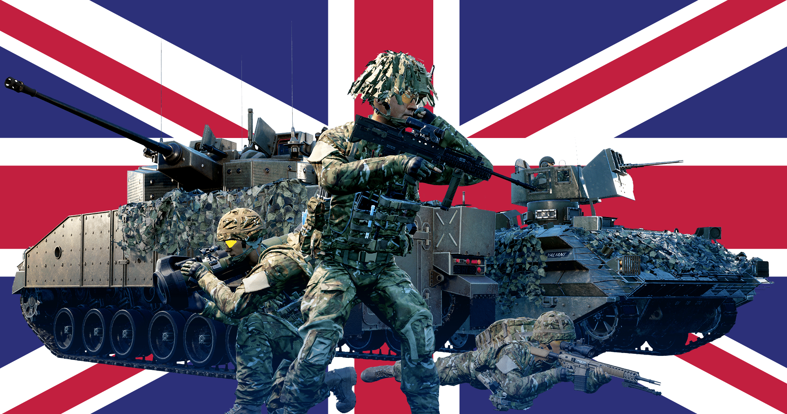

[← Back to home](../../README.md)

# British Armed Forces

## Overview
The Australian Defence Force is the military organisation comprising Australia’s army, navy, and air force. Its history lies with the Federation of Australia in 1901. Today it is a modern fighting force which works in close cooperation with Southeast Asian nations, NATO, and the United States.

## Kits & Equipment
| Role Type             | Role             | Primary Weapon                                                                                       | Secondary Weapon                                                                                       | Explosives                                                      | Smoke Grenades                                                                                       | Medical Supplies                                               | Addtl. Equipment                                                                                      |
|-----------------------|------------------|------------------------------------------------------------------------------------------------------|--------------------------------------------------------------------------------------------------------|-----------------------------------------------------------------|-------------------------------------------------------------------------------------------------------|----------------------------------------------------------------|--------------------------------------------------------------------------------------------------------|
| **Command and Support** | Squad Leader     | L85A2 Tracer + Foregrip Bipod, 7 mags                                                                | L131A1, 2 mags SA80 Bayonet                                                                          | L109A1 Fragmentation, 2 grenades                                | L132A1 White Smoke, 2 grenades L152A1 Orange Smoke, 1 grenade L152A1 Yellow Smoke, 1 grenade   | Field Dressing, 2 packages                                      | Field Binoculars Rally Point                                                                       |
|                       | Squad Leader     | L85A2 Tracer + SUSAT + Foregrip Bipod, 7 mags                                                        | L131A1, 3 mags SA80 Bayonet                                                                          | L109A1 Fragmentation, 1 grenade                                |                                                                                                       |                                                                |                                                                                                        |
|                       | Squad Leader     | L85A2 Tracer + LDS + Foregrip Bipod, 7 mags                                                          | L131A1, 2 mags SA80 Bayonet                                                                          |                                                                 |                                                                                                       |                                                                |                                                                                                        |
|                       | Lead Crewman      | L22A2 Tracer + SUSAT + Foregrip, 2 mags                                                              | L131A1, 2 mags SA80 Bayonet                                                                          | —                                                               | L132A1 White Smoke, 2 grenades                                                                        | Field Dressing, 2 packages                                      | Field Binoculars Vehicle Repair Tools Rally Point                                              |
|                       | Lead Pilot        | L22A2 Tracer + SUSAT + Foregrip, 2 mags                                                              | L131A1, 2 mags SA80 Bayonet                                                                          | —                                                               | L132A1 Red Smoke, 2 grenades                                                                          | Field Dressing, 2 packages                                      | Field Binoculars Vehicle Repair Tools Rally Point                                              |
|                       | Medic             | L85A2 + SUSAT, 6 mags                                                                                | L131A1, 2 mags SA80 Bayonet                                                                          | L109A1 Fragmentation, 1 grenade                                | L132A1 White Smoke, 2 grenades L152A1 Orange Smoke, 2 grenades                                     | Field Dressing, 9 packages Medical Kit                      | Entrenching Tool Field Binoculars                                                                  |
|                       | Medic             | L85A2 + LDS, 6 mags                                                                                  | —                                                                                                      | —                                                               |                                                                                                       |                                                                | Entrenching Tool                                                                                       |
|                       | Crewman           | L22A2 + Foregrip, 2 mags                                                                             | L131A1, 2 mags SA80 Bayonet                                                                          | —                                                               | L132A1 White Smoke, 2 grenades                                                                        | Field Dressing, 2 packages                                      | Entrenching Tool Field Binoculars Vehicle Repair Tools                                          |
|                       | Pilot             | L22A2 + Foregrip, 2 mags                                                                             | L131A1, 2 mags SA80 Bayonet                                                                          | —                                                               | L132A1 Red Smoke, 2 grenades                                                                          | Field Dressing, 2 packages                                      | Field Binoculars Vehicle Repair Tools                                                              |
| **Direct Combat**      | Rifleman          | L85A2 + SUSAT, 6 mags                                                                                | SA80 Bayonet                                                                                            | L109A1 Fragmentation, 2 grenades                                | L132A1 White Smoke, 2 grenades                                                                        | Field Dressing, 2 packages                                      | Entrenching Tool Ammo Bag Field Binoculars                                                     |
|                       | Rifleman          | L85A2 + SUSAT, 6 mags                                                                                |                                                                                                        |                                                                 |                                                                                                       |                                                                |                                                                                                        |
|                       | Rifleman          | L85A2 + LDS, 6 mags                                                                                  |                                                                                                        | L109A1 Fragmentation, 1 grenade                                |                                                                                                       |                                                                | Entrenching Tool Ammo Bag                                                                          |
|                       | Automatic Rifleman | L110A2 Minimi, 6 ammo boxes                                                                          | L131A1, 2 mags SA80 Bayonet                                                                          | L109A1 Fragmentation, 1 grenade                                | L132A1 White Smoke, 2 grenades                                                                        | Field Dressing, 2 packages                                      | Entrenching Tool Field Binoculars                                                                  |
|                       | Marksman          | L86A2 LSW + SUSAT, 7 mags                                                                            | SA80 Bayonet                                                                                            | L109A1 Fragmentation, 1 grenade                                | L132A1 White Smoke, 2 grenades                                                                        | Field Dressing, 2 packages                                      | Entrenching Tool                                                                                       |
| **Fire Support**       | Automatic Rifleman | L110A2 Minimi + SUSAT, 6 ammo boxes                                                                  | L131A1, 2 mags SA80 Bayonet                                                                          | —                                                               | L132A1 White Smoke, 2 grenades                                                                        | Field Dressing, 2 packages                                      | Entrenching Tool                                                                                       |
|                       | Grenadier         | L85A2 L123A2 + LDS, 7 mags                                                                           | SA80 Bayonet                                                                                            | L123A2 High Explosive Dual Purpose, 10 rounds                  | L123A2 Smoke Marker White, 2 rounds L123A2 Smoke Marker Blue, 2 rounds L123A2 Smoke Marker Red, 2 rounds | Field Dressing, 2 packages                                      | Entrenching Tool                                                                                       |
|                       | Light Anti-Tank   | L85A2 + SUSAT, 6 mags                                                                                | SA80 Bayonet                                                                                            | M72A7 LAW High Explosive Anti-Tank, 1 rocket L109A1 Fragmentation, 2 grenades | L132A1 White Smoke, 2 grenades                                                                        | Field Dressing, 2 packages                                      | Entrenching Tool Field Binoculars                                                                  |
|                       | Light Anti-Tank   | L85A2 + LDS, 6 mags                                                                                  |                                                                                                        | NLAW, 1 rocket M72A7 LAW High Explosive Anti-Tank, 1 rocket L109A1 Fragmentation, 1 grenade |                                                                                                       |                                                                | Entrenching Tool Field Binoculars                                                                  |
|                       | Marksman          | L129A1 Sharpshooter Rifle, 8 mags                                                                    | L131A1, 2 mags SA80 Bayonet                                                                          | —                                                               | L132A1 White Smoke, 2 grenades                                                                        | Field Dressing, 2 packages                                      | Entrenching Tool Field Binoculars                                                                  |
| **Specialist**         | Machine Gunner    | L7A2 GPMG, 8 ammo pouches                                                                            | L131A1, 2 mags SA80 Bayonet                                                                          | —                                                               | L132A1 White Smoke, 2 grenades                                                                        | Field Dressing, 2 packages                                      | Entrenching Tool Field Binoculars                                                                  |
|                       | Heavy Anti-Tank   | L85A2 + SUSAT, 4 mags                                                                                | SA80 Bayonet                                                                                            | NLAW, 1 rocket M72A7 LAW High Explosive Anti-Tank, 1 rocket | L132A1 White Smoke, 2 grenades                                                                        | Field Dressing, 2 packages                                      | Entrenching Tool                                                                                       |
|                       | Heavy Anti-Tank   | L85A2 + LDS, 4 mags                                                                                  |                                                                                                        | NLAW, 1 rocket M72A7 LAW High Explosive Anti-Tank, 1 rocket L109A1 Fragmentation, 1 grenade |                                                                                                       |                                                                | Entrenching Tool Field Binoculars                                                                  |
|                       | Combat Engineer   | L85A2 + ACOG, 6 mags                                                                                 | SA80 Bayonet                                                                                            | M112 C4 Explosive (30s Fuze), 1 block                          | L132A1 White Smoke, 4 grenades                                                                        | Field Dressing, 2 packages                                      | Entrenching Tool Vehicle Repair Tools Sandbags Razor Wire Field Binoculars                |
| **Miscellaneous**      | Recruit           | L85A2, 1 mag                                                                                         | —                                                                                                      | —                                                               | —                                                                                                     | Field Dressing, 1 package                                       | Entrenching Tool                                                                                       |
|                       | Unarmed           | —                                                                                                    | —                                                                                                      | —                                                               | —                                                                                                     | —                                                              | —                                                                                                      |