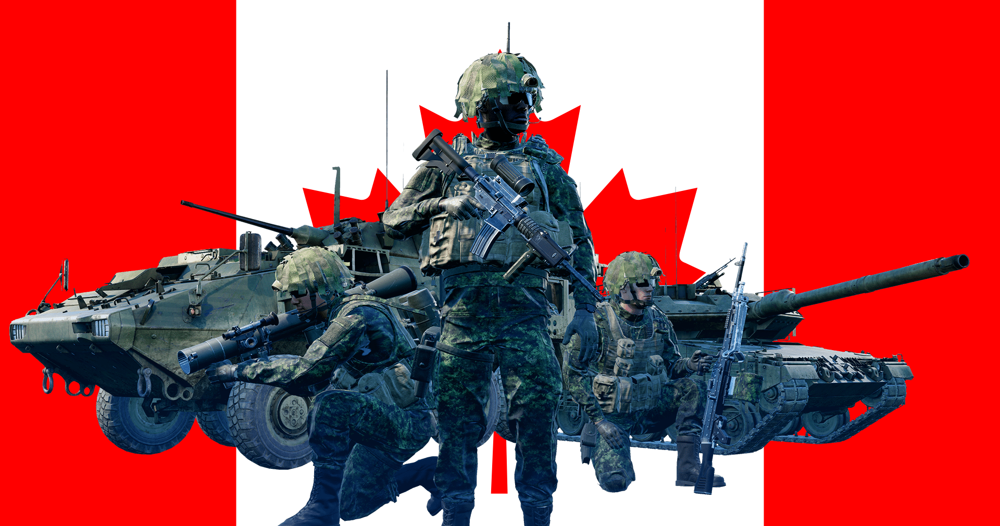
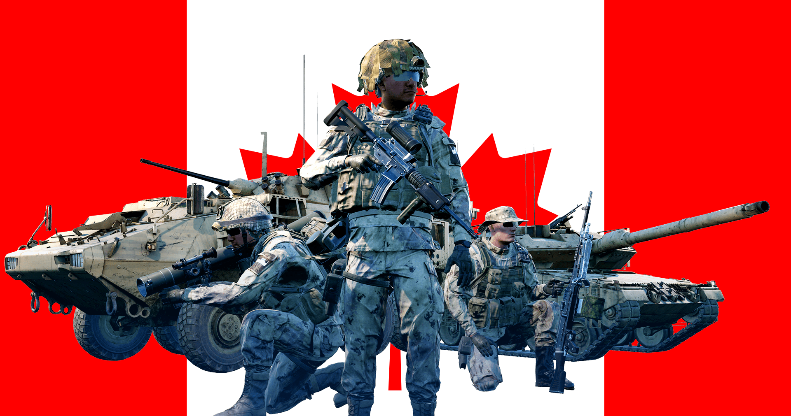

[← Back to home](../../README.md)

# Canadian Armed Forces

Forest

Desert

## Overview
The Canadian Army are the conventional ground forces of the Canadian Armed Forces. Its roots lie in the Militia Act of 1855 when the Permanent Active Militia was formed in the British colony of Canada. Today it is considered a modern military force with a large reserve.

## Kits & Equipment
| Role Type             | Role             | Primary Weapon                                                                                         | Secondary Weapon                                                                                         | Explosives                                                      | Smoke Grenades                                                                                         | Medical Supplies                                               | Addtl. Equipment                                                                                      |
|-----------------------|------------------|--------------------------------------------------------------------------------------------------------|----------------------------------------------------------------------------------------------------------|-----------------------------------------------------------------|---------------------------------------------------------------------------------------------------------|----------------------------------------------------------------|--------------------------------------------------------------------------------------------------------|
| **Command and Support** | Squad Leader     | C8A3 + C79A2 + Foregrip + Tracer, 7 mags                                                                | Hi-Power Pistol, 2 mags Bayonet2000                                                                    | C13 Fragmentation, 2 grenades                                   | M18 Smoke White, 2 grenades M18 Smoke Red, 1 grenade M18 Smoke Blue, 1 grenade                   | Field Dressing, 2 packages                                      | Field Binoculars Rally Point                                                                       |
|                       | Squad Leader     | C8A3 + ET552 + Foregrip + Tracer, 7 mags                                                                |                                                                                                          | C13 Fragmentation, 1 grenade                                     |                                                                                                       |                                                                |                                                                                                        |
|                       | Squad Leader     | C7A2 + C79A2 + Foregrip + Tracer, 5 mags                                                                |                                                                                                          |                                                                 |                                                                                                       |                                                                |                                                                                                        |
|                       | Lead Crewman      | C8A3 + Tracer, 2 mags                                                                                   | Hi-Power Pistol, 2 mags Bayonet2000                                                                    | —                                                               | M18 Smoke White, 1 grenade                                                                             | Field Dressing, 2 packages                                      | Field Binoculars Vehicle Repair Tools Rally Point                                              |
|                       | Lead Pilot        | C8A3 + Tracer, 2 mags                                                                                   | Hi-Power Pistol, 2 mags Bayonet2000                                                                    | —                                                               | M18 Smoke Red, 2 grenades                                                                             | Field Dressing, 2 packages                                      | Field Binoculars Vehicle Repair Tools Rally Point                                              |
|                       | Medic             | C7A2 + C79A2, 5 mags                                                                                   | Hi-Power Pistol, 2 mags Bayonet2000                                                                    | C13 Fragmentation, 1 grenade                                     | M18 Smoke White, 2 grenades M18 Smoke Red, 2 grenades                                              | Field Dressing, 9 packages Medical Kit                      | Field Binoculars Entrenching Tool                                                                  |
|                       | Medic             | C8A3 + C79A2, 5 mags                                                                                   | —                                                                                                        | —                                                               |                                                                                                       |                                                                | Entrenching Tool                                                                                       |
|                       | Crewman           | C8A3, 2 mags                                                                                           | Hi-Power Pistol, 2 mags Bayonet2000                                                                    | —                                                               | M18 Smoke White, 2 grenades                                                                             | Field Dressing, 2 packages                                      | Entrenching Tool Field Binoculars Vehicle Repair Tools                                          |
|                       | Pilot             | C8A3, 2 mags                                                                                           | Hi-Power Pistol, 2 mags Bayonet2000                                                                    | —                                                               | M18 Smoke Red, 2 grenades                                                                             | Field Dressing, 2 packages                                      | Field Binoculars Vehicle Repair Tools                                                              |
| **Direct Combat**      | Rifleman          | C7A2 + C79A2, 5 mags                                                                                   | Bayonet2000                                                                                               | C13 Fragmentation, 2 grenades                                   | M18 Smoke White, 2 grenades                                                                             | Field Dressing, 2 packages                                      | Entrenching Tool Ammo Bag Field Binoculars                                                     |
|                       | Rifleman          | C7A2 + C79A2 + Foregrip, 7 mags                                                                        |                                                                                                          |                                                                 |                                                                                                       |                                                                |                                                                                                        |
|                       | Rifleman          | C7A2 + ET552 + Foregrip, 5 mags                                                                        |                                                                                                          | C13 Fragmentation, 1 grenade                                     |                                                                                                       |                                                                | Entrenching Tool Ammo Bag                                                                          |
|                       | Automatic Rifleman | C9A2, 3 ammo boxes                                                                                     | Hi-Power Pistol, 2 mags Bayonet2000                                                                    | C13 Fragmentation, 1 grenade                                     | M18 Smoke White, 2 grenades                                                                             | Field Dressing, 2 packages                                      | Entrenching Tool Field Binoculars                                                                  |
| **Fire Support**       | Automatic Rifleman | C9A2 + C79A2, 3 ammo boxes                                                                             | Hi-Power Pistol, 2 mags Bayonet2000                                                                    | —                                                               | M18 Smoke White, 2 grenades                                                                             | Field Dressing, 2 packages                                      | Entrenching Tool                                                                                       |
|                       | Grenadier         | C7A2 M203A1 + C79A2, 5 mags                                                                            | Bayonet2000                                                                                               | M203 High Explosive Dual Purpose, 10 rounds                      | M203 Smoke Marker White, 2 rounds M203 Smoke Marker Blue, 2 rounds M203 Smoke Marker Red, 2 rounds | Field Dressing, 2 packages                                      | Entrenching Tool                                                                                       |
|                       | Light Anti-Tank   | C7A2 + C79A2, 5 mags                                                                                   | Bayonet2000                                                                                               | M72A7 LAW High Explosive Anti-Tank, 1 rocket C13 Fragmentation, 2 grenades | M18 Smoke White, 2 grenades                                                                             | Field Dressing, 2 packages                                      | Entrenching Tool                                                                                       |
| **Specialist**         | Sniper            | C14 Timberwolf, 8 mags                                                                                | Hi-Power Pistol, 2 mags Bayonet2000                                                                    | —                                                               | M18 Smoke White, 2 grenades                                                                             | Field Dressing, 2 packages                                      | Entrenching Tool Field Binoculars                                                                  |
|                       | Machine Gunner    | C6A1 FLEX, 8 ammo pouches                                                                              | Hi-Power Pistol, 2 mags Bayonet2000                                                                    | —                                                               | M18 Smoke White, 2 grenades                                                                             | Field Dressing, 2 packages                                      | Entrenching Tool Field Binoculars                                                                  |
|                       | Heavy Anti-Tank   | C8A3 + C79A2, 4 mags                                                                                   | Bayonet2000                                                                                               | Carl Gustav M2 Tandem + No78Mk1, 1 round Carl Gustav M2 HEAT + No78Mk1, 1 round Carl Gustav M2 HE + No78Mk1, 2 rounds | M18 Smoke White, 2 grenades                                                                             | Field Dressing, 2 packages                                      | Entrenching Tool                                                                                       |
|                       | Heavy Anti-Tank   | C8A3 + ET552, 4 mags                                                                                   |                                                                                                          | Carl Gustav M2 Tandem + No78Mk1, 1 round Carl Gustav M2 HEAT + No78Mk1, 1 round                     |                                                                                                       |                                                                | Entrenching Tool Field Binoculars                                                                  |
|                       | Combat Engineer   | C8A3 + C79A2, 5 mags                                                                                   | Bayonet2000                                                                                               | M112 C4 Explosive (30s Fuze), 1 block                            | M18 Smoke White, 4 grenades                                                                             | Field Dressing, 2 packages                                      | Entrenching Tool Vehicle Repair Tools Sandbags Razor Wire                                   |
| **Miscellaneous**      | Recruit           | C7A2, 1 mag                                                                                           | —                                                                                                        | —                                                               | —                                                                                                       | Field Dressing, 1 package                                       | Entrenching Tool                                                                                       |
|                       | Unarmed           | —                                                                                                     | —                                                                                                        | —                                                               | —                                                                                                       | —                                                              | —                                                                                                      |