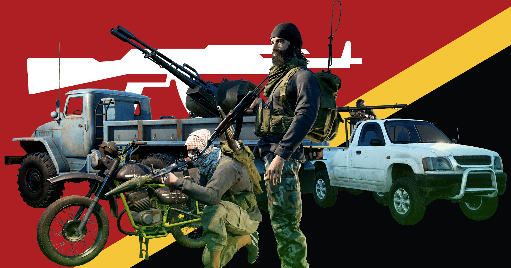

[← Back to home](../../README.md)

# Insurgents

## Overview
Originally a band of political dissidents, the insurgents as they have come to be known, started growing at an alarming rate with the intervention of foreign powers in their country. Now they pose a significant threat by holding various strategic corners of the countryside and have even made incursions into more urban environments.

## Kits & Equipment
| Role Type             | Role             | Primary Weapon                                              | Secondary Weapon                                                | Explosives                                             | Smoke Grenades                                      | Medical Supplies                    | Addtl. Equipment                                                   |
|-----------------------|------------------|-------------------------------------------------------------|-----------------------------------------------------------------|------------------------------------------------------|---------------------------------------------------|-------------------------------------|-------------------------------------------------------------------|
| **Command and Support** | Cell Leader     | PM md. 63, 7 mags                                            | Vz. 61 Škorpion, 3 mags AKM Bayonet                          | F1 Fragmentation, 2 grenades                        | RDG2 White Smoke, 2 grenades RDG2 Black Smoke, 1 grenade RDG2 Yellow Smoke, 1 grenade | Field Dressing, 2 packages           | Soviet Field Binoculars Rally Point                               |
|                       | Cell Leader     | AKM, 4 drum mags                                             |                                                                 |                                                      |                                                   |                                     |                                                                     |
|                       | Cell Leader     | AKS-74 + 1P29, 6 mags                                        | TT33 Tokarev, 2 mags AKM Bayonet                             |                                                      |                                                   |                                     |                                                                     |
|                       | Lead Crewman      | Vz. 61 Škorpion, 3 mags                                      | PM Makarov, 2 mags AKM Bayonet                               | —                                                    | RDG2 White Smoke, 2 grenades                    | Field Dressing, 2 packages           | Soviet Field Binoculars Vehicle Repair Tools Rally Point      |
|                       | Medic             | AMD-65, 7 mags                                               | TT33 Tokarev, 4 mags AKM Bayonet                             | F1 Fragmentation, 2 grenades                        | RDG2 White Smoke, 2 grenades RDG2 Yellow Smoke, 2 grenades | Field Dressing, 9 packages Medical Kit | MPL50 Spade Soviet Field Binoculars                              |
|                       | Medic             | SKS + PU, 12 clips                                           | TT33 Tokarev, 2 mags SKS Bayonet                             | F1 Fragmentation, 1 grenade                         |                                                   |                                     | MPL50 Spade                                                        |
|                       | Crewman           | Vz. 61 Škorpion, 3 mags                                      | TT33 Tokarev, 2 mags AKM Bayonet                             | —                                                    | RDG2 White Smoke, 2 grenades                    | Field Dressing, 2 packages           | MPL50 Spade Soviet Field Binoculars Vehicle Repair Tools      |
| **Direct Combat**      | Fighter          | AKM, 7 mags                                                  | PM Makarov, 4 mags AKM Bayonet                               | F1 Fragmentation, 2 grenades                        | RDG2 White Smoke, 2 grenades                    | Field Dressing, 2 packages           | MPL50 Spade Ammo Bag Soviet Field Binoculars                  |
|                       | Fighter          | AKMS, 7 mags                                                 |                                                                 |                                                      |                                                   |                                     |                                                                     |
|                       | Fighter          | FN FAL, 7 mags                                               | PM Makarov, 2 mags AKM Bayonet                               |                                                      |                                                   |                                     |                                                                     |
|                       | Fighter          | G3A3, 7 mags                                                 |                                                                 |                                                      |                                                   |                                     |                                                                     |
|                       | Fighter          | Mosin Nagant M1891/30, 12 clips                              |                                                                 |                                                      |                                                   |                                     |                                                                     |
|                       | Fighter          | AKS-74 + 1P29, 6 mags                                        |                                                                 | F1 Fragmentation, 1 grenade                         |                                                   |                                     |                                                                     |
|                       | Raider            | PPSh-41, 4 stick mags, 2 drum mags                           | PM Makarov, 4 mags AKM Bayonet                               | RKG-3 Anti-Tank Grenade, 4 grenades F1 Fragmentation, 2 grenades | RDG2 White Smoke, 2 grenades                    | Field Dressing, 2 packages           | MPL50 Spade Soviet Field Binoculars                              |
|                       | Automatic Rifleman | RPK, 8 drum mags                                             | PM Makarov, 2 mags AKM Bayonet                               | F1 Fragmentation, 1 grenade                         | RDG2 White Smoke, 2 grenades                    | Field Dressing, 2 packages           | MPL50 Spade Soviet Field Binoculars                              |
| **Fire Support**       | Automatic Rifleman | RPD, 6 drum mags                                             | PM Makarov, 2 mags AKM Bayonet                               | —                                                    | RDG2 White Smoke, 2 grenades                    | Field Dressing, 2 packages           | MPL50 Spade Soviet Field Binoculars                              |
|                       | Grenadier         | AKM + GP-25, 7 mags                                          | PM Makarov, 2 mags AKM Bayonet                               | GP-25 Fragmentation, 10 rounds                     | GP-25 Smoke Marker White, 2 rounds GP-25 Smoke Marker Blue, 2 rounds GP-25 Smoke Marker Red, 2 rounds | Field Dressing, 2 packages           | MPL50 Spade Soviet Field Binoculars                              |
|                       | Light Anti-Tank  | AKMS, 6 mags                                                 | AKM Bayonet                                                    | RPG-7 High Explosive Anti-Tank, 2 rockets RPG-7 Fragmentation, 3 rockets | RDG2 White Smoke, 2 grenades                    | Field Dressing, 2 packages           | MPL50 Spade Soviet Field Binoculars                              |
|                       | Light Anti-Tank  | SKS + PU, 12 clips                                           | SKS Bayonet                                                    | RPG-7 High Explosive Anti-Tank, 1 rocket RPG-7 Fragmentation, 2 rockets | RDG2 White Smoke, 2 grenades                    | Field Dressing, 2 packages           | MPL50 Spade                                                        |
|                       | Marksman           | SVD, 9 mags                                                  | TT33 Tokarev, 2 mags AKM Bayonet                             | F1 Fragmentation, 1 grenade                         | RDG2 White Smoke, 2 grenades                    | Field Dressing, 2 packages           | MPL50 Spade Soviet Field Binoculars Infantry Camo Netting     |
| **Specialist**         | Machine Gunner    | PKM, 6 ammo boxes                                            | PM Makarov, 2 mags AKM Bayonet                               | —                                                    | RDG2 White Smoke, 2 grenades                    | Field Dressing, 2 packages           | MPL50 Spade Soviet Field Binoculars                              |
|                       | Sniper             | Mosin Nagant M1891/30 + PU-1, 12 clips                        | TT33 Tokarev, 2 mags AKM Bayonet                             | —                                                    | RDG2 White Smoke, 2 grenades                    | Field Dressing, 2 packages           | MPL50 Spade Soviet Field Binoculars                              |
|                       | Heavy Anti-Tank   | SKS, 12 clips                                                | SKS Bayonet                                                    | RPG-7 Tandem Heavy Anti-Tank, 1 rocket RPG-7 High Explosive Anti-Tank, 1 rocket RPG-7 Fragmentation, 2 rockets | RDG2 White Smoke, 2 grenades                    | Field Dressing, 2 packages           | MPL50 Spade Soviet Field Binoculars                              |
|                       | Heavy Anti-Tank   |                                                             |                                                                 | RPG-29 Tandem Heavy Anti-Tank, 2 rockets            |                                                   |                                     |                                                                     |
|                       | Sapper             | PPSh-41, 4 stick mags                                        | AKM Bayonet                                                    | Improvised Explosive Device, 1 bomb TNT 600g Explosive (30s Fuze), 1 block TM62 Anti-Tank Mine, 2 mines Decoy Rock, 5 rocks | Cell Phone Detonator RDG2 White Smoke, 2 grenades | Field Dressing, 2 packages           | MPL50 Spade Soviet Field Binoculars                              |
| **Miscellaneous**      | Recruit           | AKM, 1 mag                                                   | —                                                               | —                                                    | —                                                 | Field Dressing, 1 package             | MPL50 Spade                                                        |
|                       | Unarmed           | —                                                            | —                                                               | —                                                    | —                                                 | —                                   | —                                                                 |

