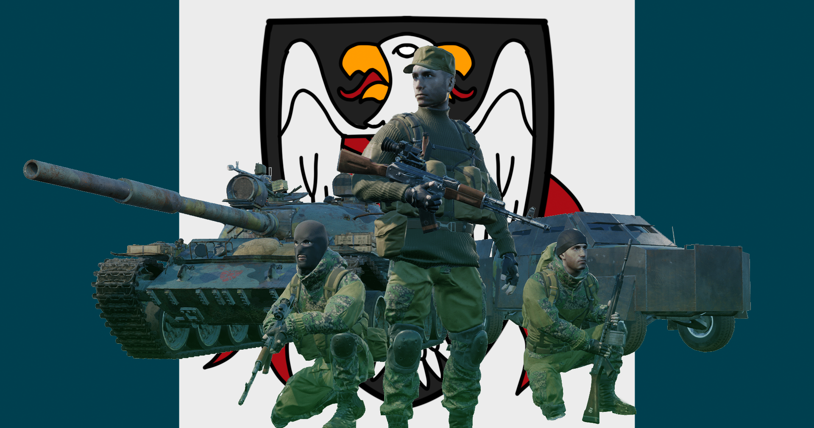

[← Back to home](../../README.md)

# Irregular Militia Forces

## Overview
This unconventional force of freedom fighters, para-military guerrillas and deserters roams across the Eastern European plains, causing chaos wherever they go. Primarily funded by arms and drug shipping, they possess a large array of weapons and hardware, making them a formidable fighting force.

## Kits & Equipment
| Role Type            | Role            | Primary Weapon                                               | Secondary Weapon                                                | Explosives                                           | Smoke Grenades                                      | Medical Supplies                    | Addtl. Equipment                                                   |
|----------------------|-----------------|--------------------------------------------------------------|-----------------------------------------------------------------|-----------------------------------------------------|---------------------------------------------------|-------------------------------------|-------------------------------------------------------------------|
| **Command and Support** | Squad Leader    | AKS-74U + Banana Mag, 6 mags                                  | TT33 Tokarev, 4 mags AKM Bayonet                             | RGD5 Fragmentation, 2 grenades                     | RDG2 White Smoke, 2 grenades RDG2 Green Smoke, 1 grenade RDG2 Yellow Smoke, 1 grenade | Field Dressing, 2 packages           | Soviet Field Binoculars Rally Point                               |
|                      | Squad Leader    | M4 + M68, 7 mags                                              |                                                                 |                                                     |                                                   |                                     |                                                                     |
|                      | Squad Leader    | AKS-74 + 1P29, 6 mags                                         | TT33 Tokarev, 2 mags AKM Bayonet                             |                                                     |                                                   |                                     |                                                                     |
|                      | Squad Leader    | AK-74 + GP-25 + 1P63, 6 mags                                  | TT33 Tokarev, 2 mags AKM Bayonet                             | GP-25 Fragmentation, 2 rounds RKG3 Anti-Tank Grenade, 1 grenade | GP-25 Smoke Marker White, 2 rounds GP-25 Smoke Marker Blue, 2 rounds GP-25 Smoke Marker Red, 2 rounds |                                     |                                                                     |
|                      | Squad Leader    | M16A2 + M203 + 3×20 Optic, 7 mags                             | TT33 Tokarev, 2 mags AKM Bayonet                             | M203 Fragmentation, 2 rounds                      | M203 Smoke Marker White, 2 rounds M203 Smoke Marker Blue, 2 rounds M203 Smoke Marker Red, 2 rounds |                                     |                                                                     |
|                      | Lead Crewman     | AKS-74U, 2 mags                                               | PM Makarov, 2 mags AKM Bayonet                               | —                                                   | RDG2 White Smoke, 2 grenades                    | Field Dressing, 2 packages           | Soviet Field Binoculars Vehicle Repair Tools Rally Point      |
|                      | Medic            | AKS-74U, 7 mags                                               | TT33 Tokarev, 4 mags AKM Bayonet                             | RGD5 Fragmentation, 2 grenades                     | RDG2 White Smoke, 2 grenades RDG2 Green Smoke, 2 grenades | Field Dressing, 9 packages Medical Kit | MPL50 Spade Soviet Field Binoculars                              |
|                      | Medic            | AKS-74 + 1P29, 6 mags                                         | TT33 Tokarev, 2 mags AKM Bayonet                             | RGD5 Fragmentation, 1 grenade                      |                                                   |                                     | MPL50 Spade                                                        |
|                      | Crewman          | AKS-74U, 2 mags                                               | PM Makarov, 2 mags AKM Bayonet                               | —                                                   | RDG2 White Smoke, 2 grenades                    | Field Dressing, 2 packages           | MPL50 Spade Soviet Field Binoculars Vehicle Repair Tools      |
| **Direct Combat**     | Rifleman        | FN FAL, 7 mags                                                | G3 Bayonet                                                      | RGD5 Fragmentation, 2 grenades                     | RDG2 White Smoke, 2 grenades                    | Field Dressing, 2 packages           | MPL50 Spade Sandbags Ammo Bag Soviet Field Binoculars      |
|                      | Rifleman        | M16A2, 7 mags                                                 | M9 Bayonet                                                      |                                                     |                                                   |                                     |                                                                     |
|                      | Rifleman        | AKS-74 + 1P63, 7 mags                                         | AKM Bayonet                                                     |                                                     |                                                   |                                     |                                                                     |
|                      | Rifleman        | M4 + M68, 7 mags                                              | M9 Bayonet                                                      |                                                     |                                                   |                                     | MPL50 Spade Ammo Bag Soviet Field Binoculars                  |
|                      | Rifleman        | M16A2 + 3×20 Optic, 7 mags                                    | AKM Bayonet                                                     |                                                     |                                                   |                                     | MPL50 Spade Ammo Bag                                            |
|                      | Rifleman        | SKS + PU, 12 clips                                            | SKS Bayonet                                                     |                                                     |                                                   |                                     |                                                                     |
|                      | Ambusher        | FN FAL, 6 mags                                                | G3 Bayonet                                                      | FN FAL Fragmentation Rifle Grenade, 5 grenades     | RDG2 White Smoke, 2 grenades                    | Field Dressing, 2 packages           | MPL50 Spade Soviet Field Binoculars Infantry Camo Netting     |
|                      | Ambusher        | M16A2, 7 mags                                                 | M9 Bayonet                                                      | RGD5 Fragmentation, 2 grenades RKG3 Anti-Tank Grenade, 2 grenades |                                                   |                                     |                                                                     |
|                      | Automatic Rifleman | Minimi, 3 ammo boxes                                          | PM Makarov, 4 mags AKM Bayonet                               | RGD5 Fragmentation, 1 grenade                      | RDG2 White Smoke, 2 grenades                    | Field Dressing, 2 packages           | MPL50 Spade Soviet Field Binoculars                              |
| **Fire Support**      | Infiltrator     | AKS-74U + Banana Mag, 6 mags                                  | Vz. 61 Škorpion, 3 mags AKM Bayonet                          | RGD5 Fragmentation, 2 grenades RKG3 Anti-Tank Grenade, 4 grenades | RDG2 White Smoke, 2 grenades                    | Field Dressing, 2 packages           | MPL50 Spade Soviet Field Binoculars                              |
|                      | Automatic Rifleman | RPK-74 + 1P78, 10 mags                                        | PM Makarov, 4 mags AKM Bayonet                               | RGD5 Fragmentation, 1 grenade                      | RDG2 White Smoke, 2 grenades                    | Field Dressing, 2 packages           | MPL50 Spade                                                        |
|                      | Grenadier       | AKS-74 + 1P63, 7 mags                                         | AKM Bayonet                                                     | RPG-7 Fragmentation, 5 rockets RGD5 Fragmentation, 2 grenades | RDG2 White Smoke, 2 grenades                    | Field Dressing, 2 packages           | MPL50 Spade Soviet Field Binoculars                              |
|                      | Grenadier       | M16A2 + M203, 7 mags                                          | AKM Bayonet                                                     | M203 Fragmentation, 10 rounds                      | M203 Smoke Marker White, 2 rounds M203 Smoke Marker Blue, 2 rounds M203 Smoke Marker Red, 2 rounds |                                     |                                                                     |
|                      | Light Anti-Tank | FN FAL, 6 mags                                                | AKM Bayonet                                                     | FN FAL HEAT Rifle Grenade, 5 grenades              | RDG2 White Smoke, 2 grenades                    | Field Dressing, 2 packages           | MPL50 Spade Soviet Field Binoculars                              |
|                      | Light Anti-Tank | AKS-74 + 1P29, 6 mags                                         | AKM Bayonet                                                     | RPG-7 High Explosive Anti-Tank, 2 rockets RPG-7 Fragmentation, 2 rockets | RDG2 White Smoke, 2 grenades                    | Field Dressing, 2 packages           | MPL50 Spade                                                        |
|                      | Marksman        | SVD, 9 mags                                                   | TT33 Tokarev, 2 mags AKM Bayonet                             | RGD5 Fragmentation, 1 grenade                      | RDG2 White Smoke, 2 grenades                    | Field Dressing, 2 packages           | MPL50 Spade Soviet Field Binoculars Infantry Camo Netting     |
| **Specialist**        | Machine Gunner  | PKM + 1P29, 6 ammo boxes                                      | PM Makarov, 4 mags AKM Bayonet                               | —                                                   | RDG2 White Smoke, 2 grenades                    | Field Dressing, 2 packages           | MPL50 Spade Soviet Field Binoculars                              |
|                      | Heavy Anti-Tank | AKS-74U, 4 mags                                               | AK74 Bayonet                                                    | RPG-7 Tandem Heavy Anti-Tank, 2 rockets RPG-7 Fragmentation, 2 rockets | RDG2 White Smoke, 2 grenades                    | Field Dressing, 2 packages           | MPL50 Spade Soviet Field Binoculars                              |
|                      | Heavy Anti-Tank | M16A2, 7 mags                                                 | AK74 Bayonet                                                    | RPG-29 Tandem Heavy Anti-Tank, 2 rockets            |                                                   |                                     |                                                                     |
|                      | Saboteur        | AKS-74U + Banana Mag, 6 mags                                  | AK74 Bay

## Vehicles