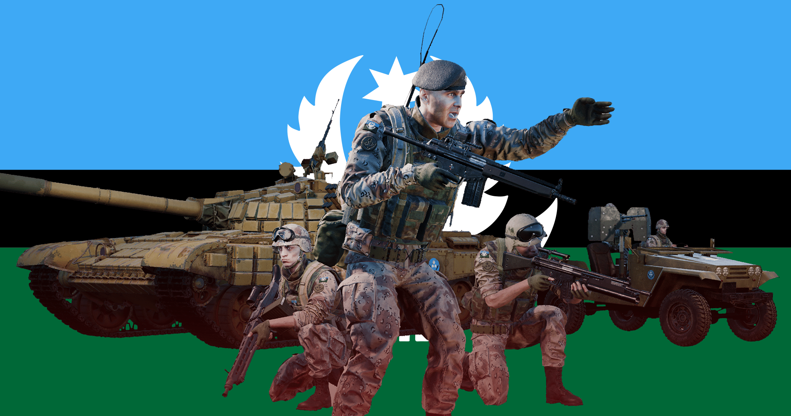

[← Back to home](../../README.md)

# Middle Eastern Alliance

## Overview
The MEA is a military organisation formed out of the need to coordinate resources and defence policy between a number of aligned nations in the region. Their use of well-trained indigenous personnel and stockpiles of foreign armament means that they are well adapted to fighting against the most technologically advanced of opponents.

## Kits & Equipment
| Role Type             | Role             | Primary Weapon                                               | Secondary Weapon                                                | Explosives                                             | Smoke Grenades                                      | Medical Supplies                    | Addtl. Equipment                                                   |
|-----------------------|------------------|--------------------------------------------------------------|-----------------------------------------------------------------|------------------------------------------------------|---------------------------------------------------|-------------------------------------|-------------------------------------------------------------------|
| **Command and Support** | Squad Leader   | G3A4 + Tracer, 7 mags                                          | Hi-Power, 2 mags G3 Bayonet                                    | F1 Fragmentation, 2 grenades                        | M18 White Smoke, 2 grenades M18 Yellow Smoke, 1 grenade M18 Green Smoke, 1 grenade | Field Dressing, 2 packages           | Soviet Field Binoculars Rally Point                            |
|                       | Squad Leader   | G3A4 + Z-Point + Tracer, 7 mags                                |                                                                 |                                                      |                                                   |                                     |                                                                     |
|                       | Squad Leader   | G3A4 + ZF1 + Tracer, 6 mags                                    |                                                                 | F1 Fragmentation, 1 grenade                         |                                                   |                                     |                                                                     |
|                       | Lead Crewman      | HK 51, 3 mags                                                 | Hi-Power, 2 mags G3 Bayonet                                    | —                                                    | M18 White Smoke, 2 grenades                     | Field Dressing, 2 packages           | Soviet Field Binoculars Vehicle Repair Tools Rally Point     |
|                       | Lead Pilot        | HK 51, 3 mags                                                 | Hi-Power, 2 mags G3 Bayonet                                    | —                                                    | M18 Yellow Smoke, 2 grenades                    | Field Dressing, 2 packages           | Soviet Field Binoculars Vehicle Repair Tools Rally Point     |
|                       | Medic             | G3A3, 7 mags                                                  | Hi-Power, 3 mags G3 Bayonet                                    | F1 Fragmentation, 1 grenade                         | M18 White Smoke, 2 grenades M18 Yellow Smoke, 2 grenades | Field Dressing, 9 packages Medical Kit | Entrenching Tool Soviet Field Binoculars                        |
|                       | Medic             | G3A3 + ZF1, 6 mags                                             | Hi-Power, 2 mags G3 Bayonet                                    | —                                                    |                                                   |                                     | Entrenching Tool                                                        |
|                       | Crewman           | HK 51, 3 mags                                                 | Hi-Power, 2 mags G3 Bayonet                                    | —                                                    | M18 White Smoke, 2 grenades                     | Field Dressing, 2 packages           | Entrenching Tool Soviet Field Binoculars Vehicle Repair Tools |
|                       | Pilot             | HK 51, 3 mags                                                 | Hi-Power, 2 mags G3 Bayonet                                    | —                                                    | M18 Yellow Smoke, 2 grenades                    | Field Dressing, 2 packages           | Soviet Field Binoculars Vehicle Repair Tools                    |
| **Direct Combat**      | Rifleman          | G3A3, 7 mags                                                  | G3 Bayonet                                                      | F1 Fragmentation, 2 grenades                        | M18 White Smoke, 2 grenades                     | Field Dressing, 2 packages           | Entrenching Tool Ammo Bag Soviet Field Binoculars            |
|                       | Rifleman          | G3A3 + Z-Point, 7 mags                                         |                                                                 |                                                      |                                                   |                                     |                                                                     |
|                       | Rifleman          | G3A3 + ZF1, 6 mags                                             |                                                                 | F1 Fragmentation, 1 grenade                         |                                                   |                                     | Entrenching Tool Ammo Bag                                        |
|                       | Automatic Rifleman | G3A3, 7 drum mags                                             | Hi-Power, 2 mags G3 Bayonet                                    | F1 Fragmentation, 1 grenade                         | M18 White Smoke, 2 grenades                     | Field Dressing, 2 packages           | Entrenching Tool Soviet Field Binoculars                        |
| **Fire Support**       | Automatic Rifleman | G3A3 + ZF1, 7 drum mags                                        | Hi-Power, 2 mags G3 Bayonet                                    | —                                                    | M18 White Smoke, 2 grenades                     | Field Dressing, 2 packages           | Entrenching Tool                                                        |
|                       | Grenadier         | G3A3 + HK79 + ZF1, 6 mags                                       | G3 Bayonet                                                      | HK79 High Explosive, 10 rounds                      | HK79 Smoke Marker White, 2 rounds HK79 Smoke Marker Blue, 2 rounds HK79 Smoke Marker Red, 2 rounds | Field Dressing, 2 packages           | Entrenching Tool                                                        |
|                       | Light Anti-Tank | G3KA4, 7 mags                                                 | G3 Bayonet                                                      | RPG-7V2 High Explosive Anti-Tank, 1 rocket RPG-7V2 Fragmentation, 2 rockets | M18 White Smoke, 2 grenades                     | Field Dressing, 2 packages           | Entrenching Tool Soviet Field Binoculars                        |
|                       | Light Anti-Tank | G3KA4 + ZF1, 6 mags                                             |                                                                 | RPG-26 High Explosive Anti-Tank, 1 rocket F1 Fragmentation, 2 grenades | M18 White Smoke, 2 grenades                     | Field Dressing, 2 packages           | Entrenching Tool                                                        |
|                       | Marksman           | G3SG/1, 7 mags                                                | Hi-Power, 2 mags G3 Bayonet                                    | —                                                    | M18 White Smoke, 2 grenades                     | Field Dressing, 2 packages           | Entrenching Tool Soviet Field Binoculars                        |
| **Specialist**         | Machine Gunner    | MG3, 4 ammo boxes                                             | Hi-Power, 2 mags G3 Bayonet                                    | —                                                    | M18 White Smoke, 2 grenades                     | Field Dressing, 2 packages           | Entrenching Tool                                                        |
|                       | Heavy Anti-Tank   | G3KA4 + Z-Point, 4 mags                                        | G3 Bayonet                                                      | RPG-29 Tandem Heavy Anti-Tank, 2 rockets            | M18 White Smoke, 2 grenades                     | Field Dressing, 2 packages           | Entrenching Tool Soviet Field Binoculars                        |
|                       | Combat Engineer   | G3KA4 + Z-Point, 4 mags                                        | G3 Bayonet                                                      | SZ-1 Explosive (30s Fuze), 1 block TM62 Anti-Tank Mine, 3 mines | M18 White Smoke, 2 grenades                     | Field Dressing, 2 packages           | Entrenching Tool Vehicle Repair Tools Sandbags Razor Wire Soviet Field Binoculars |
| **Miscellaneous**      | Recruit           | G3A3, 1 mag                                                   | —                                                               | —                                                    | —                                                 | Field Dressing, 1 package             | Entrenching Tool                                                        |
|                       | Unarmed           | —                                                              | —                                                               | —                                                    | —                                                 | —                                   | —                                                                 |

