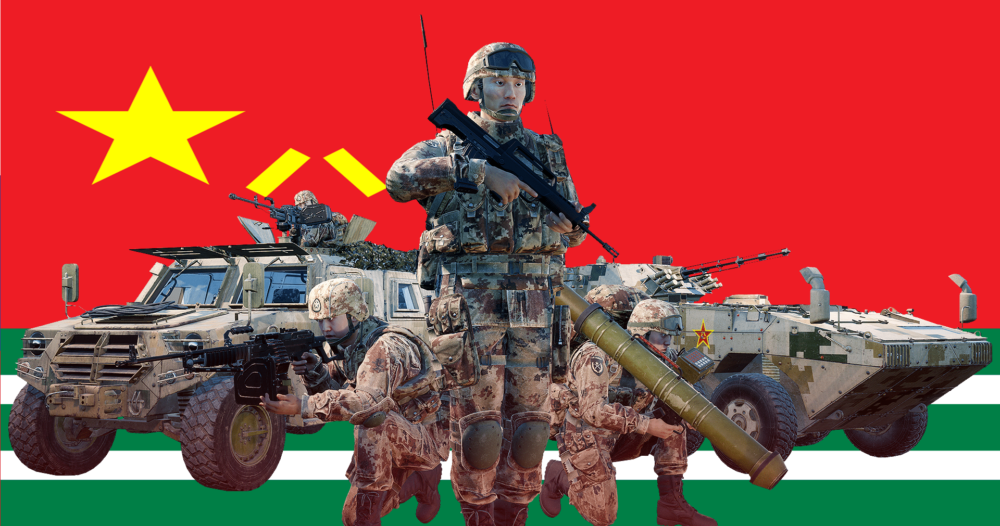

[← Back to home](../../README.md)

# People’s Liberation Army Amphibious Ground Force

Forest

Desert

## Overview
The People’s Liberation Army Amphibious Ground Force (PLAAGF) is a playable faction in Squad. This faction is the 14th playable faction and the 12th conventional army featured in the game.

## Kits & Equipment
| Role Type            | Role            | Primary Weapon                                                       | Secondary Weapon                                                   | Explosives                                               | Smoke Grenades                                                             | Medical Supplies                     | Addtl. Equipment                                                            |
|----------------------|-----------------|----------------------------------------------------------------------|----------------------------------------------------------------------|----------------------------------------------------------|----------------------------------------------------------------------------|--------------------------------------|----------------------------------------------------------------------------|
| **Command and Support** | Squad Leader    | QBZ95-1, 7 mags                                                       | QSZ92, 2 mags QNL95 Bayonet                                         | Type 86P Fragmentation, 2 grenades                       | DSF161 Smoke White, 2 grenades DFS161 Smoke Red, 1 grenade DFS161 Smoke Blue, 1 grenade | Field Dressing, 2 packages            | Type 95 Binoculars Rally Point                                            |
|                      | Squad Leader    | QBZ95-1 + Holo Sight, 7 mags                                           |                                                                      | Type 86P Fragmentation, 2 grenades                       |                                                                        |                                      |                                                                            |
|                      | Squad Leader    | QBZ95-1 + YMA600, 6 mags                                               |                                                                      | Type 86P Fragmentation, 1 grenade                       |                                                                        |                                      |                                                                            |
|                      | Lead Crewman     | QBZ95B-1, 2 mags                                                      | QSZ92, 2 mags QNL95 Bayonet                                         | —                                                        | DSF161 Smoke White, 2 grenades                                                | Field Dressing, 2 packages            | Type 95 Binoculars Vehicle Repair Tools Rally Point                      |
|                      | Lead Pilot       | QBZ95B-1, 2 mags                                                      | QSZ92, 2 mags QNL95 Bayonet                                         | —                                                        | DSF161 Smoke Red, 2 grenades                                                  | Field Dressing, 2 packages            | Type 95 Binoculars Vehicle Repair Tools Rally Point                      |
|                      | Medic            | QBZ95-1, 7 mags                                                       | QSZ92, 2 mags QNL95 Bayonet                                         | Type 86P Fragmentation, 1 grenade                       | DSF161 Smoke White, 2 grenades DSF161 Smoke Blue, 2 grenades            | Field Dressing, 9 packages Medical Kit | WJQ308 Type 95 Binoculars                                          |
|                      | Medic            | QBZ95-1 + YMA600, 6 mags                                               | —                                                                    | —                                                        |                                                                        |                                      | WJQ308                                                             |
|                      | Crewman          | QBZ95B-1, 2 mags                                                      | QSZ92, 2 mags QNL95 Bayonet                                         | —                                                        | DSF161 Smoke White, 2 grenades                                                | Field Dressing, 2 packages            | WJQ308 Type 95 Binoculars Vehicle Repair Tools                 |
|                      | Pilot            | QBZ95B-1, 2 mags                                                      | QSZ92, 2 mags QNL95 Bayonet                                         | —                                                        | DSF161 Smoke Red, 2 grenades                                                  | Field Dressing, 2 packages            | Type 95 Binoculars Vehicle Repair Tools                                     |
| **Direct Combat**     | Rifleman         | QBZ95-1, 7 mags                                                       | QNL95 Bayonet                                                       | Type 86P Fragmentation, 2 grenades                       | DSF161 Smoke White, 2 grenades                                                | Field Dressing, 2 packages            | WJQ308 Ammo Bag Type 95 Binoculars                             |
|                      | Rifleman         | QBZ95-1 + Holo Sight, 7 mags                                           |                                                                      | Type 86P Fragmentation, 2 grenades                       |                                                                        |                                      |                                                                            |
|                      | Rifleman         | QBZ95-1 + YMA600, 6 mags                                               |                                                                      | Type 86P Fragmentation, 1 grenade                       |                                                                        |                                      | WJQ308 Ammo Bag                                                 |
|                      | Automatic Rifleman | QJB95-1, 8 drum mags                                                   | QSZ92, 2 mags QNL95 Bayonet                                         | Type 86P Fragmentation, 1 grenade                       | DSF161 Smoke White, 2 grenades                                                | Field Dressing, 2 packages            | WJQ308                                                             |
| **Fire Support**      | Automatic Rifleman | QJB95-1 + YMA600, 8 drum mags                                          | QSZ92, 2 mags QNL95 Bayonet                                         | —                                                        | DSF161 Smoke White, 2 grenades                                                | Field Dressing, 2 packages            | WJQ308                                                             |
|                      | Grenadier        | QBZ95-1 + QLG10 + YMA600, 7 mags                                       | QNL95 Bayonet                                                       | QLG10 High Explosive, 10 rounds                          | QLG10 Smoke Marker White, 2 rounds QLG10 Smoke Marker Blue, 2 rounds QLG10 Smoke Marker Red, 2 rounds | Field Dressing, 2 packages            | WJQ308                                                             |
|                      | Light Anti-Tank  | QBZ95-1 + Holo Sight, 7 mags                                           | QNL95 Bayonet                                                       | DZJ08 Multipurpose Assault Munition, 1 rocket Type 86P Fragmentation, 2 grenades | DSF161 Smoke White, 2 grenades                                                | Field Dressing, 2 packages            | WJQ308 Type 95 Binoculars                                          |
|                      | Light Anti-Tank  | QBZ95-1 + YMA600, 6 mags                                               |                                                                      | —                                                        |                                                                        |                                      | WJQ308                                                             |
|                      | Marksman         | QBU88, 9 mags                                                         | QSZ92, 2 mags QNL95 Bayonet                                         | —                                                        | DSF161 Smoke White, 2 grenades                                                | Field Dressing, 2 packages            | WJQ308 Type 95 Binoculars                                          |
| **Specialist**        | Machine Gunner   | QJY88 + YMA95, 5 ammo boxes                                            | QSZ92, 2 mags QNL95 Bayonet                                         | —                                                        | DSF161 Smoke White, 2 grenades                                                | Field Dressing, 2 packages            | WJQ308                                                             |
|                      | Heavy Anti-Tank  | QBZ95B-1, 4 mags                                                      | QNL95 Bayonet                                                       | PF98 Tandem High Explosive Anti Tank, 1 round PF98 Multipurpose High Explosive Incendiary, 1 round | DSF161 Smoke White, 2 grenades                                                | Field Dressing, 2 packages            | WJQ308 Type 95 Binoculars                                          |
|                      | Combat Engineer  | QBZ95-1 + Holo Sight, 4 mags                                            | QNL95 Bayonet                                                       | TNT (30s Fuze), 1 block Type 72 Anti-Tank Mine, 3 mines | DSF161 Smoke White, 2 grenades                                                | Field Dressing, 2 packages            | WJQ308 Vehicle Repair Tools Sandbags Razor Wire Type 95 Binoculars            |
| **Miscellaneous**     | Recruit          | QBZ95-1, 1 mag                                                         | —                                                                    | —                                                        | —                                                                      | Field Dressing, 1 package              | WJQ308                                                             |
|                      | Unarmed          | —                                                                    | —                                                                    | —                                                        | —                                                                      | —                                    | —                                                                          |

## Vehicles