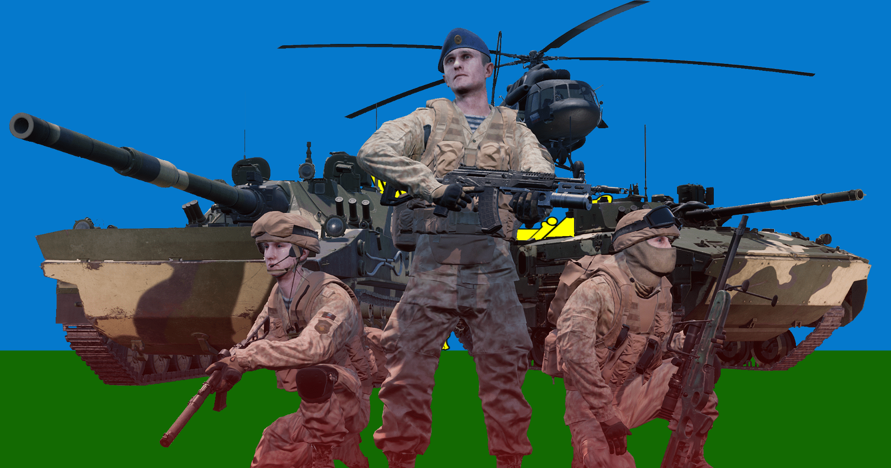

[← Back to home](../../README.md)

# Russian Airborne Forces

Forest

Desert

## Overview
The VDV are the airborne forces of Russia, which are typically used as high-readiness mechanized infantry.

## Kits & Equipment
| Role Type             | Role             | Primary Weapon                                               | Secondary Weapon                                                | Explosives                                             | Smoke Grenades                                      | Medical Supplies                    | Addtl. Equipment                                                   |
|-----------------------|------------------|--------------------------------------------------------------|-----------------------------------------------------------------|------------------------------------------------------|---------------------------------------------------|-------------------------------------|-------------------------------------------------------------------|
| **Command and Support** | Senior Rifleman   | AK-12 + GP-25, 7 mags                                          | MP443 Grach, 2 mags AK74 Bayonet                              | GP-25 Fragmentation, 2 rounds                        | GP-25 Smoke Marker White, 6 rounds               | Field Dressing, 2 packages           | Russian Field Binoculars Rally Point                            |
|                       | Senior Rifleman   | AK-12 + GP-25 + 1P87, 7 mags                                   |                                                                 |                                                      |                                                   |                                     |                                                                     |
|                       | Senior Rifleman   | AK-12 + GP-25 + 1P78, 6 mags                                   |                                                                 |                                                      |                                                   |                                     |                                                                     |
|                       | Lead Crewman      | AK-12, 2 mags                                                 | MP443 Grach, 2 mags AK74 Bayonet                              | —                                                    | RDG2 White Smoke, 2 grenades                     | Field Dressing, 2 packages           | Russian Field Binoculars Vehicle Repair Tools Rally Point     |
|                       | Lead Pilot        | AK-12, 2 mags                                                 | MP443 Grach, 2 mags AK74 Bayonet                              | —                                                    | RDG2 White Orange, 2 grenades                    | Field Dressing, 2 packages           | Russian Field Binoculars Vehicle Repair Tools Rally Point     |
|                       | Medic             | AK-12 + 1P87, 7 mags                                          | MP443 Grach, 3 mags AK74 Bayonet                              | RGO Fragmentation, 1 grenade                         | RDG2 White Smoke, 2 grenades RDG2 Orange Smoke, 2 grenades | Field Dressing, 9 packages Medical Kit | MPL50 Spade Russian Field Binoculars                        |
|                       | Medic             | AK-12 + 1P78, 6 mags                                          | MP443 Grach, 2 mags AK74 Bayonet                              | —                                                    |                                                   |                                     | MPL50 Spade                                                        |
|                       | Crewman           | AK-12, 2 mags                                                 | MP443 Grach, 2 mags AK74 Bayonet                              | —                                                    | RDG2 White Smoke, 2 grenades                     | Field Dressing, 2 packages           | MPL50 Spade Russian Field Binoculars Vehicle Repair Tools     |
|                       | Pilot             | AK-12, 2 mags                                                 | MP443 Grach, 2 mags AK74 Bayonet                              | —                                                    | RDG2 Orange Smoke, 2 grenades                    | Field Dressing, 2 packages           | Russian Field Binoculars Vehicle Repair Tools                    |
| **Direct Combat**      | Rifleman          | AK-12 + Foregrip, 7 mags                                       | AK74 Bayonet                                                    | RGO Fragmentation, 2 grenades                        | RDG2 White Smoke, 2 grenades                     | Field Dressing, 2 packages           | MPL50 Spade Ammo Bag Russian Field Binoculars                |
|                       | Rifleman          | AK-12 + 1P87 + Foregrip, 7 mags                                |                                                                 |                                                      |                                                   |                                     |                                                                     |
|                       | Rifleman          | AK-12 + 1P78 + Foregrip, 6 mags                                |                                                                 | RGO Fragmentation, 1 grenade                         |                                                   |                                     | MPL50 Spade Ammo Bag                                            |
|                       | Automatic Rifleman | RPK-74M, 8 mags                                               | MP443 Grach, 2 mags AK74 Bayonet                              | RGO Fragmentation, 1 grenade                         | RDG2 White Smoke, 2 grenades                     | Field Dressing, 2 packages           | MPL50 Spade Russian Field Binoculars                            |
| **Fire Support**       | Automatic Rifleman | RPK-74M + 1P78, 8 mags                                         | MP443 Grach, 2 mags AK74 Bayonet                              | —                                                    | RDG2 White Smoke, 2 grenades                     | Field Dressing, 2 packages           | MPL50 Spade                                                        |
|                       | Grenadier         | AK-12 + GP-25 + 1P87, 7 mags                                   | AK74 Bayonet                                                    | GP-25 Fragmentation, 10 rounds                       | GP-25 Smoke Marker White, 6 rounds               | Field Dressing, 2 packages           | MPL50 Spade                                                        |
|                       | Rifleman Anti-Tank | AK-12 + 1P87, 7 mags                                           | AK74 Bayonet                                                    | RPG-7V2 High Explosive Anti-Tank, 2 rockets RPG-7V2 Fragmentation, 2 rockets | RDG2 White Smoke, 2 grenades                     | Field Dressing, 2 packages           | MPL50 Spade Russian Field Binoculars                            |
|                       | Rifleman Anti-Tank | AK-12 + 1P78, 6 mags                                           |                                                                 | RPG-7 High Explosive Anti-Tank, 1 rocket RPG-7 Fragmentation, 2 rockets | RDG2 White Smoke, 2 grenades                     | Field Dressing, 2 packages           | MPL50 Spade                                                        |
|                       | Scout             | AS-VAL + OKP-7, 7 mags                                         | MP443 Grach, 2 mags AK74 Bayonet                              | —                                                    | RDG2 White Smoke, 2 grenades                     | Field Dressing, 2 packages           | MPL50 Spade Russian Field Binoculars                            |
| **Specialist**         | Machine Gunner    | PKP Pecheneg, 6 ammo boxes                                     | MP443 Grach, 2 mags AK74 Bayonet                              | —                                                    | RDG2 White Smoke, 2 grenades                     | Field Dressing, 2 packages           | MPL50 Spade                                                        |
|                       | Heavy Anti-Tank   | AK-12 + 1P87, 7 mags                                           | AK74 Bayonet                                                    | RPG-7V2 Tandem Heavy Anti-Tank, 2 rockets RPG-7V2 Fragmentation, 2 rockets | RDG2 White Smoke, 2 grenades                     | Field Dressing, 2 packages           | MPL50 Spade Russian Field Binoculars                            |
|                       | Heavy Anti-Tank   | AK-12 + 1P78, 6 mags                                           |                                                                 | RPG-7 Tandem Heavy Anti-Tank, 1 rocket RPG-7 High Explosive Anti-Tank, 1 rocket | RDG2 White Smoke, 2 grenades                     | Field Dressing, 2 packages           | MPL50 Spade                                                        |
|                       | Combat Engineer   | AK-12 + 1P87, 4 mags                                           | AK74 Bayonet                                                    | SZ-1 Explosive (30s Fuze), 1 block TM62 Anti-Tank Mine, 3 mines | RDG2 White Smoke, 2 grenades                     | Field Dressing, 2 packages           | MPL50 Spade Vehicle Repair Tools Sandbags Razor Wire Russian Field Binoculars |
|                       | Sniper            | SV-98M, 8 mags                                                 | MP443 Grach, 2 mags AK74 Bayonet                              | —                                                    | RDG2 White Smoke, 2 grenades                     | Field Dressing, 2 packages           | MPL50 Spade Russian Field Binoculars                            |
| **Miscellaneous**      | Recruit           | AK-12, 1 mag                                                   | —                                                               | —                                                    | —                                                 | Field Dressing, 1 package             | MPL50 Spade                                                        |
|                       | Unarmed           | —                                                              | —                                                               | —                                                    | —                                                 | —                                   | —                                                                 |

