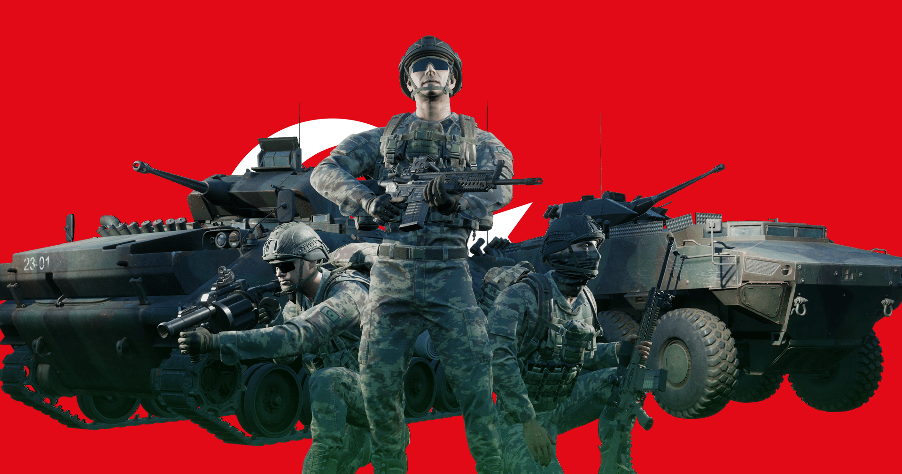

# Turkish Land Forces

## Overview
The Turkish Land Forces (TLF) is the ground combat branch of the Turkish Armed Forces. It was founded after the dissolution of the Ottoman Empire. Turkiye has been a member of NATO since 1952. The TLF has recently been modernising and strengthening its numbers due to various conflicts in the region.

## Kits & Equipment
| Role Type           | Role                  | Primary Weapon                                              | Secondary Weapon                      | Explosives                                                        | Smoke Grenades                                            | Medical Supplies                | Addtl. Equipment                                             |
|---------------------|-----------------------|-------------------------------------------------------------|---------------------------------------|------------------------------------------------------------------|-----------------------------------------------------------|---------------------------------|-------------------------------------------------------------|
| Command and Support | Squad Leader          | MPT-76 + Angled Foregrip + Tracer, 8 mags                    | SOR-9, 2 mags                         | G3 Bayonet, M67 Fragmentation, 2 grenades                        | M18 Smoke White, 2 grenades; M18 Smoke Yellow, 1 grenade; M18 Smoke Green, 1 grenade | Field Dressing, 2 packages      | Field Binoculars                                             |
|                     | Rally Point           | MPT-76 + HNA + Angled Foregrip + Tracer, 8 mags; MPT-76 + A940 + Angled Foregrip + Tracer, 7 mags | —                                     | M67 Fragmentation, 1 grenade                                     | —                                                         | —                               | —                                                           |
|                     | Lead Crewman          | SOR-109T + HNA, 2 mags                                       | SOR-9, 2 mags                         | G3 Bayonet                                                      | M18 Smoke White, 2 grenades                                | Field Dressing, 2 packages      | Field Binoculars, Vehicle Repair Tools, Rally Point          |
|                     | Lead Pilot            | SOR-109T + HNA, 2 mags                                       | SOR-9, 2 mags                         | G3 Bayonet                                                      | M18 Smoke Yellow, 2 grenades                               | Field Dressing, 2 packages      | Field Binoculars, Vehicle Repair Tools, Rally Point          |
|                     | Medic                 | MPT-76 + HNA, 8 mags; MPT-76 + A940, 7 mags                  | SOR-9, 2 mags                         | G3 Bayonet, M67 Fragmentation, 1 grenade                         | M18 Smoke White, 2 grenades; M18 Smoke Yellow, 2 grenades   | Field Dressing, 9 packages      | Medical Kit, Entrenching Tool, Field Binoculars             |
|                     | Crewman               | SOR-109T + HNA, 2 mags                                       | SOR-9, 2 mags                         | G3 Bayonet                                                      | M18 Smoke White, 2 grenades                                | Field Dressing, 2 packages      | Entrenching Tool, Field Binoculars, Vehicle Repair Tools     |
|                     | Pilot                 | SOR-109T + HNA, 2 mags                                       | SOR-9, 2 mags                         | G3 Bayonet                                                      | M18 Smoke Yellow, 2 grenades                               | Field Dressing, 2 packages      | Field Binoculars, Vehicle Repair Tools                      |
| Direct Combat       | Rifleman              | MPT-76 + Angled Foregrip, 8 mags; MPT-76 + HNA, 8 mags; MPT-76 + A940, 7 mags | —                                     | G3 Bayonet, M67 Fragmentation, 2 grenades; M67 Fragmentation, 1 grenade | M18 Smoke White, 2 grenades                                | Field Dressing, 2 packages      | Entrenching Tool, Ammo Bag, Field Binoculars                |
|                     | Machine Gunner        | MG3, 6 ammo boxes                                            | SOR-9, 2 mags                         | G3 Bayonet, M67 Fragmentation, 1 grenade                         | M18 Smoke White, 2 grenades                                | Field Dressing, 2 packages      | Entrenching Tool, Field Binoculars                          |
|                     | Jandarma              | SOR-109T + HNA, 9 mags                                       | SOR-9, 2 mags                         | G3 Bayonet, M67 Fragmentation, 2 grenades                        | M18 Smoke White, 2 grenades                                | Field Dressing, 2 packages      | Entrenching Tool, Field Binoculars                          |
| Fire Support        | Grenadier             | MPT-76 AK-40GL + A940, 7 mags; MPT-76, 6 mags                | —                                     | G3 Bayonet, AK-40GL High Explosive Dual Purpose, 10 rounds; MKE MGL High Explosive Dual Purpose, 12 rounds | AK-40GL Smoke White, 2 rounds; MKE MGL White Smoke, 12 Rounds; AK-40GL Smoke Blue, 2 rounds; AK-40GL Smoke Red, 2 rounds | Field Dressing, 2 packages      | Entrenching Tool, Field Binoculars                          |
|                     | Light Anti-Tank       | MPT-76, 8 mags; MPT-76 + HNA, 8 mags; MPT-76 + A940, 7 mags | —                                     | G3 Bayonet, RPG-7V2 High Explosive Anti-Tank, 2 rockets; RPG-7V2 Fragmentation, 2 rockets; HAR-66 LAW High Explosive Anti-Tank, 2 rockets | M18 Smoke White, 2 grenades                                | Field Dressing, 2 packages      | Entrenching Tool, Field Binoculars                          |
|                     | Marksman              | KNT-67 + KESKIN, 7 mags                                      | SOR-9, 2 mags                         | G3 Bayonet                                                      | M18 Smoke White, 2 grenades                                | Field Dressing, 2 packages      | Entrenching Tool, Field Binoculars                          |
| Specialist          | Machine Gunner        | PMT-76 + A940, 8 ammo pouches                                | SOR-9, 2 mags                         | G3 Bayonet                                                      | M18 Smoke White, 2 grenades                                | Field Dressing, 2 packages      | Entrenching Tool                                            |
|                     | Heavy Anti-Tank       | MPT-76, 8 mags                                               | —                                     | G3 Bayonet, Carl Gustaf M2 Tandem Heavy Anti-Tank, 1 round; Carl Gustaf M2 High Explosive Anti Tank, 1 round | M18 Smoke White, 2 grenades                                | Field Dressing, 2 packages      | Entrenching Tool                                            |
|                     | Combat Engineer       | MPT-76, 6 mags                                               | —                                     | G3 Bayonet, M112 C4 Explosive (30s Fuze), 1 block; M15 Anti-Tank Mine, 3 mines | M18 Smoke White, 2 grenades                                | Field Dressing, 2 packages      | Entrenching Tool, Vehicle Repair Tools, Sandbags, Razor Wire, Field Binoculars |
| Miscellaneous       | Recruit               | MPT-76, 1 mag                                                | —                                     | —                                                                | —                                                         | Field Dressing, 1 package       | Entrenching Tool                                            |
|                     | Unarmed               | —                                                           | —                                     | —                                                                | —                                                         | —                               | —                                                           |

## Vehicles