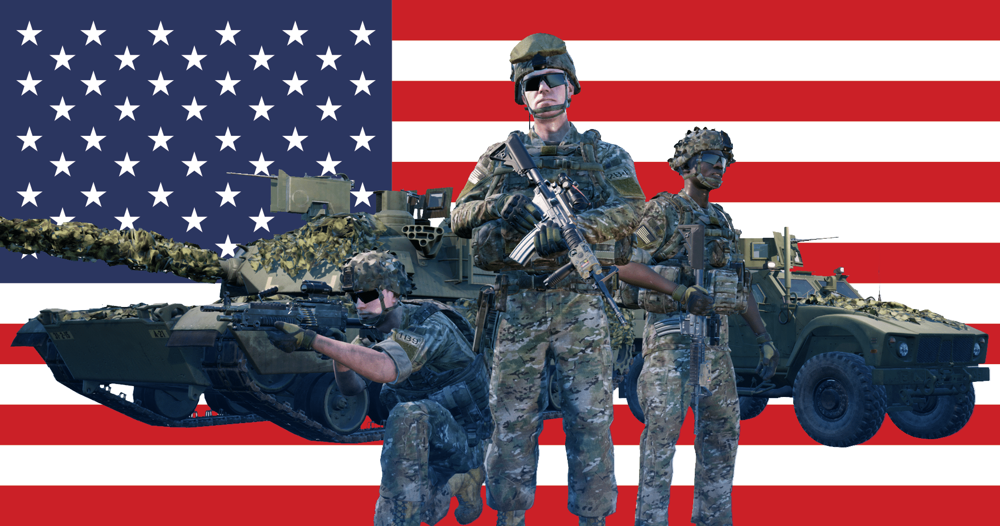

[← Back to home](../../README.md)

# United States Army

## Overview
The United States Army is the land warfare branch of the US Armed Forces. It is one of the largest military organisations in the world, responsible for the US Military's land based efforts. The US Army has gained much experience as a result of their extensive participation in warfare, they are also one of the most technologically advanced armies in the world.

## Kits & Equipment
| Role Type            | Role            | Primary Weapon                                                       | Secondary Weapon                                                   | Explosives                                               | Smoke Grenades                                                             | Medical Supplies                     | Addtl. Equipment                                                            |
|----------------------|-----------------|----------------------------------------------------------------------|----------------------------------------------------------------------|----------------------------------------------------------|----------------------------------------------------------------------------|--------------------------------------|----------------------------------------------------------------------------|
| **Command and Support** | Squad Leader    | M4A1 Tracer + Vertical Grip, 7 mags                                   | M17 MHS, 2 mags M9 Bayonet                                         | M67 Fragmentation, 2 grenades                                | M18 Smoke White, 2 grenades M18 Smoke Red, 1 grenade M18 Smoke Blue, 1 grenade | Field Dressing, 2 packages            | Field Binoculars Rally Point                                               |
|                      | Squad Leader    | M4A1 Tracer + M68 + Vertical Grip, 7 mags                             |                                                                      | M67 Fragmentation, 2 grenades                                |                                                                        |                                      |                                                                            |
|                      | Squad Leader    | M4A1 Tracer + M150 + Vertical Grip, 7 mags                            |                                                                      | M67 Fragmentation, 1 grenade                                |                                                                        |                                      |                                                                            |
|                      | Lead Crewman     | M4, 2 mags                                                           | M17 MHS, 2 mags M9 Bayonet                                         | —                                                          | M18 Smoke White, 2 grenades                                                | Field Dressing, 2 packages            | Field Binoculars Vehicle Repair Tools Rally Point                      |
|                      | Lead Pilot       | M4, 2 mags                                                           | M17 MHS, 2 mags M9 Bayonet                                         | —                                                          | M18 Smoke Red, 2 grenades                                                  | Field Dressing, 2 packages            | Field Binoculars Vehicle Repair Tools Rally Point                      |
|                      | Medic            | M4 + M68, 7 mags                                                     | M17 MHS, 2 mags M9 Bayonet                                         | M67 Fragmentation, 1 grenade                                | M18 Smoke White, 2 grenades M18 Smoke Red, 2 grenades                   | Field Dressing, 9 packages Medical Kit | Entrenching Tool Field Binoculars                                          |
|                      | Medic            | M4 + M150, 6 mags                                                    | —                                                                    | —                                                          |                                                                        |                                      | Entrenching Tool                                                             |
|                      | Crewman          | M4, 2 mags                                                           | M17 MHS, 2 mags M9 Bayonet                                         | —                                                          | M18 Smoke White, 2 grenades                                                | Field Dressing, 2 packages            | Entrenching Tool Field Binoculars Vehicle Repair Tools                 |
|                      | Pilot            | M4, 2 mags                                                           | M17 MHS, 2 mags M9 Bayonet                                         | —                                                          | M18 Smoke Red, 2 grenades                                                  | Field Dressing, 2 packages            | Field Binoculars Vehicle Repair Tools                                     |
| **Direct Combat**     | Rifleman         | M4A1 + Vertical Grip, 7 mags                                         | M9 Bayonet                                                           | M67 Fragmentation, 2 grenades                                | M18 Smoke White, 2 grenades                                                | Field Dressing, 2 packages            | Entrenching Tool Ammo Bag Field Binoculars                             |
|                      | Rifleman         | M4A1 + M68, 7 mags                                                   |                                                                      | M67 Fragmentation, 2 grenades                                |                                                                        |                                      |                                                                            |
|                      | Rifleman         | M4 + M150, 6 mags                                                    |                                                                      | M67 Fragmentation, 1 grenade                                |                                                                        |                                      | Entrenching Tool Ammo Bag                                                 |
|                      | Automatic Rifleman | M249 PIP + M68, 6 ammo boxes                                          | M17 MHS, 2 mags M9 Bayonet                                         | M67 Fragmentation, 1 grenade                                | M18 Smoke White, 2 grenades                                                | Field Dressing, 2 packages            | Entrenching Tool Field Binoculars                                          |
| **Fire Support**      | Automatic Rifleman | M249 PIP + M145, 6 ammo boxes                                         | M17 MHS, 2 mags M9 Bayonet                                         | —                                                          | M18 Smoke White, 2 grenades                                                | Field Dressing, 2 packages            | Entrenching Tool                                                             |
|                      | Grenadier        | M4 M203 + M150, 7 mags                                               | M9 Bayonet                                                           | M203 High Explosive Dual Purpose, 10 rounds                | M203 Smoke Marker White, 2 rounds M203 Smoke Marker Blue, 2 rounds M203 Smoke Marker Red, 2 rounds | Field Dressing, 2 packages            | Entrenching Tool                                                             |
|                      | Light Anti-Tank  | M4 + M68, 7 mags                                                     | M9 Bayonet                                                           | M136 AT-4 CS High Explosive Anti-Tank, 1 rocket M67 Fragmentation, 2 grenades | M18 Smoke White, 2 grenades                                                | Field Dressing, 2 packages            | Entrenching Tool Field Binoculars                                          |
|                      | Light Anti-Tank  | M4 + M150, 6 mags                                                    |                                                                      | M72A7 LAW High Explosive Anti-Tank, 1 rocket M67 Fragmentation, 2 grenades |                                                                        |                                      | Entrenching Tool                                                             |
|                      | Marksman         | M110 SASS, 8 mags                                                    | M17 MHS, 2 mags M9 Bayonet                                         | —                                                          | M18 Smoke White, 2 grenades                                                | Field Dressing, 2 packages            | Entrenching Tool Field Binoculars                                          |
| **Specialist**        | Machine Gunner   | M240B + M145, 8 ammo pouches                                         | M17 MHS, 2 mags M9 Bayonet                                         | —                                                          | M18 Smoke White, 2 grenades                                                | Field Dressing, 2 packages            | Entrenching Tool                                                             |
|                      | Heavy Anti-Tank  | M4, 4 mags                                                           | M9 Bayonet                                                           | M3 MAAWS Tandem Heavy Anti-Tank, 1 round M3 MAAWS High Explosive Anti-Tank, 1 round | M3 MAAWS Smoke, 2 rounds M18 Smoke White, 2 grenades                    | Field Dressing, 2 packages            | Entrenching Tool Field Binoculars                                          |
|                      | Heavy Anti-Tank  | M4 + M68, 4 mags                                                     |                                                                      | M3 MAAWS Tandem Heavy Anti-Tank, 1 round M3 MAAWS High Explosive Anti-Tank, 1 round |                                                                        |                                      | Entrenching Tool                                                             |
|                      | Combat Engineer  | M4 + M68, 4 mags                                                     | M9 Bayonet                                                           | M112 C4 Explosive (30s Fuze), 1 block M15 Anti-Tank Mine, 3 mines | M18 Smoke White, 2 grenades                                                | Field Dressing, 2 packages            | Entrenching Tool Vehicle Repair Tools Sandbags Razor Wire            |
| **Miscellaneous**     | Recruit          | M4, 1 mag                                                            | —                                                                    | —                                                          | —                                                                      | Field Dressing, 1 package              | Entrenching Tool                                                             |
|                      | Unarmed          | —                                                                    | —                                                                    | —                                                          | —                                                                      | —                                    | —                                                                          |

