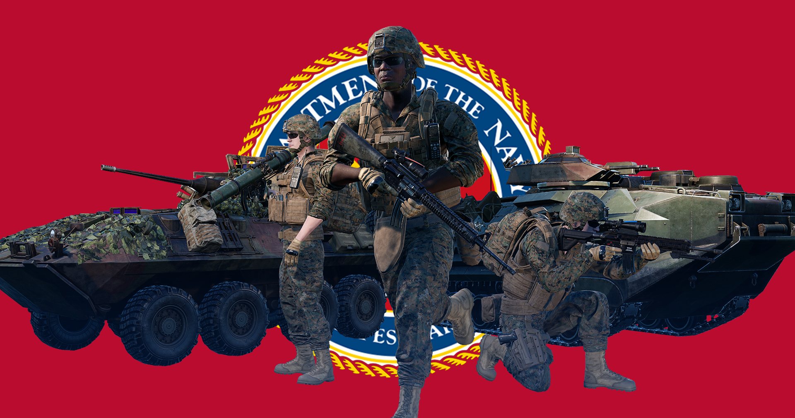
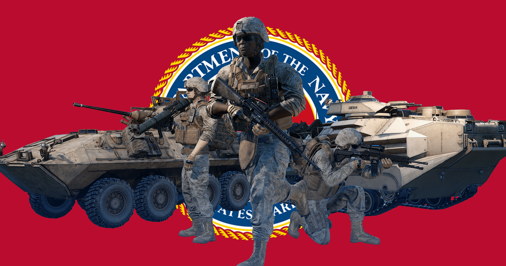

[← Back to home](../README.md)

# United States Marine Corps

Forest

Desert

## Overview
The USMC is the maritime land force service branch of the United States Armed Forces responsible for conducting expeditionary and amphibious operations through combined arms, implementing its own infantry, armor, artillery and aerial units.

## Kits & Equipment
| Role Type           | Role                 | Primary Weapon                                        | Secondary Weapon | Explosives                                              | Smoke Grenades                                      | Medical Supplies            | Addtl. Equipment                                   |
|---------------------|----------------------|-------------------------------------------------------|------------------|--------------------------------------------------------|----------------------------------------------------|-----------------------------|---------------------------------------------------|
| Command and Support | Squad Leader         | M16A4 Tracer + Vertical Grip, 7 mags                  | M9A1, 2 mags     | M67 Fragmentation, 2 grenades                          | M18 Smoke White, 2 grenades; M18 Smoke Red, 1 grenade; M18 Smoke Blue, 1 grenade | Field Dressing, 2 packages   | Field Binoculars                                  |
|                     | Rally Point          | M27 IAR Tracer + Vertical Grip, 7 mags; M16A4 Tracer + M150 + Vertical Grip, 7 mags | —                | M67 Fragmentation, 1 grenade                           | —                                                  | —                           | —                                                 |
|                     | Lead Crewman         | M4, 2 mags                                            | M9A1, 2 mags     | OKC-3S                                                  | M18 Smoke White, 2 grenades                        | Field Dressing, 2 packages   | Field Binoculars, Vehicle Repair Tools, Rally Point |
|                     | Lead Pilot           | M4, 2 mags                                            | M9A1, 2 mags     | OKC-3S                                                  | M18 Smoke Red, 2 grenades                          | Field Dressing, 2 packages   | Field Binoculars, Vehicle Repair Tools, Rally Point |
|                     | Medic                | M16A4 + Vertical Grip, 7 mags                         | M9A1, 2 mags     | M67 Fragmentation, 1 grenade                           | M18 Smoke White, 2 grenades; M18 Smoke Red, 2 grenades | Field Dressing, 9 packages   | Medical Kit, Entrenching Tool, Field Binoculars   |
|                     |                      | M16A4 + M150, 6 mags                                  | —                | —                                                      | —                                                  | —                           | Entrenching Tool                                   |
|                     | Crewman              | M4, 2 mags                                            | M9A1, 2 mags     | OKC-3S                                                  | M18 Smoke White, 2 grenades                        | Field Dressing, 2 packages   | Entrenching Tool, Field Binoculars, Vehicle Repair Tools |
|                     | Pilot                | M4, 2 mags                                            | M9A1, 2 mags     | OKC-3S                                                  | M18 Smoke Red, 2 grenades                          | Field Dressing, 2 packages   | Entrenching Tool, Field Binoculars, Vehicle Repair Tools |
| Direct Combat       | Rifleman             | M16A4 + Vertical Grip, 7 mags                         | —                | M67 Fragmentation, 2 grenades                          | M18 Smoke White, 2 grenades                        | Field Dressing, 2 packages   | Entrenching Tool, Ammo Bag, Field Binoculars      |
|                     |                      | M4 + Vertical Grip, 7 mags; M16A4 + M150 + Vertical Grip, 6 mags | —              | M67 Fragmentation, 1 grenade                           | —                                                  | —                           | Entrenching Tool, Ammo Bag                        |
|                     | Automatic Rifleman   | M27 IAR + SDO, 12 mags                                | M9A1, 2 mags     | OKC-3S                                                  | M18 Smoke White, 2 grenades                        | Field Dressing, 2 packages   | Entrenching Tool                                   |
| Fire Support        | Automatic Rifleman   | M249 PIP + SDO, 6 ammo boxes                          | M9A1, 2 mags     | OKC-3S                                                  | M18 Smoke White, 2 grenades                        | Field Dressing, 2 packages   | Entrenching Tool                                   |
|                     | Grenadier            | M16A4 M203 + M150, 7 mags                             | OKC-3S           | M203 High Explosive Dual Purpose, 10 rounds            | M203 Smoke Marker White, 2 rounds; M203 Smoke Marker Blue, 2 rounds; M203 Smoke Marker Red, 2 rounds | Field Dressing, 2 packages   | Entrenching Tool                                   |
|                     | Light Anti-Tank      | M4, 7 mags                                            | OKC-3S           | M136 AT-4 CS High Explosive Anti-Tank, 1 rocket        | M67 Fragmentation, 2 grenades; M18 Smoke White, 2 grenades | Field Dressing, 2 packages   | Entrenching Tool, Field Binoculars                |
|                     |                      | M16A4 + M150, 6 mags                                  | —                | M72A7 LAW High Explosive Anti-Tank, 1 rocket           | M67 Fragmentation, 2 grenades                      | —                           | Entrenching Tool                                   |
| Marksman            |                      | M38 DMR, 8 mags                                       | M9A1, 2 mags     | OKC-3S                                                  | M18 Smoke White, 2 grenades                        | Field Dressing, 2 packages   | Entrenching Tool, Field Binoculars                |
| Specialist          | Machine Gunner       | M240G + MGO, 8 ammo pouches                           | M9A1, 2 mags     | OKC-3S                                                  | M18 Smoke White, 2 grenades                        | Field Dressing, 2 packages   | Entrenching Tool                                   |
|                     | Heavy Anti-Tank      | M4, 4 mags                                            | OKC-3S           | MK153 SMAW HE Anti-Armor, 1 round; MK153 SMAW HE Dual-Purpose, 1 round; MK153 SMAW Spotting Rifle, 3 mags | M18 Smoke White, 2 grenades                        | Field Dressing, 2 packages   | Entrenching Tool, Field Binoculars                |
|                     |                      | M16A4, 4 mags                                         | —                | —                                                      | —                                                  | —                           | —                                                 |
| Combat Engineer     |                      | M16A4, 4 mags                                         | OKC-3S           | M112 C4 Explosive (30s Fuze), 1 block; M15 Anti-Tank Mine, 1 mine | M18 Smoke White, 2 grenades                        | Field Dressing, 2 packages   | Entrenching Tool, Vehicle Repair Tools, Sandbags, Razor Wire, Field Binoculars |
| Miscellaneous       | Recruit              | M16A4, 1 mag                                          | —                | —                                                      | —                                                  | Field Dressing, 1 package    | Entrenching Tool                                   |
|                     | Unarmed              | —                                                     | —                | —                                                      | —                                                  | —                           | —                                                 |

## Vehicles